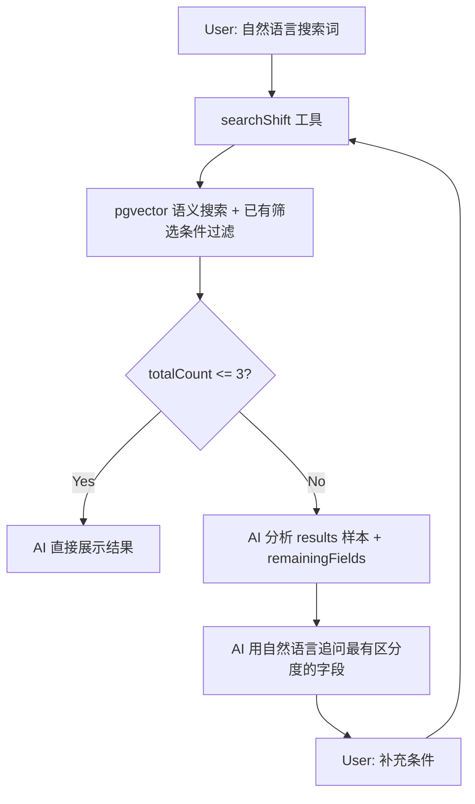

# Search Shift 智能搜索功能

## 整体架构




## 改动清单

### 1. Neon 数据库：开启 pgvector + 添加 embedding 列

运行 SQL 脚本（类似之前创建 Shift 表的方式）：

```sql
CREATE EXTENSION IF NOT EXISTS vector;
ALTER TABLE "Shift" ADD COLUMN "embedding" vector(1536);
```

使用 1536 维度（OpenAI text-embedding-3-small 的默认维度，Vercel AI Gateway 支持）。

同步修改 [lib/db/schema.ts](lib/db/schema.ts) 中的 `shift` 表定义，添加 `embedding` 列。因为 Drizzle ORM 对 pgvector 类型不原生支持，该列可用 `text` 类型声明或使用 `drizzle-orm/pg-core` 的 `customType`。实际查询时用 raw SQL 处理向量操作。

### 2. 修改 createShift 工具：保存时生成 embedding

修改 [lib/ai/tools/create-shift.ts](lib/ai/tools/create-shift.ts)：

- 在 `execute` 中，调用嵌入 API（通过 Vercel AI Gateway）将 `rawMessage` 转成向量
- 将向量和其他字段一起存入 Shift 表
- 使用 AI SDK 的 `embed` 函数（from `ai`）+ Vercel AI Gateway 的嵌入模型

同步修改 [lib/db/queries.ts](lib/db/queries.ts) 中的 `saveShift` 函数，增加 `embedding` 参数。

### 3. 新建 searchShift 工具

新建 [lib/ai/tools/search-shift.ts](lib/ai/tools/search-shift.ts)：

**inputSchema（6 个可选筛选字段 + 1 个必填搜索词）：**

- `query`（string, 必填）— 用户的语义搜索词（累积所有轮次的用户输入）
- `whattodo`（string, 可选）— 筛选条件
- `startTime`（string, 可选）— 筛选条件
- `location`（string, 可选）— 筛选条件
- `skillsNeeded`（string, 可选）— 筛选条件
- `peopleHelped`（string, 可选）— 筛选条件
- `laborCredits`（string, 可选）— 筛选条件

**execute 逻辑：**

1. 将 `query` 转成嵌入向量
2. 用 pgvector 的 `<=>` 余弦距离做语义相似度排序
3. 对已填的筛选字段，用 `ILIKE '%keyword%'` 做 WHERE 过滤
4. 返回 `{ totalCount, results (前10条), appliedFilters, remainingFields }`

**返回格式：**

```typescript
{
  totalCount: number,
  results: Shift[],           // 前 10 条完整内容
  appliedFilters: Record<string, string>,  // 已应用的筛选
  remainingFields: string[]   // 还可以追问的字段名
}
```

### 4. 新增 searchShifts 数据库查询函数

在 [lib/db/queries.ts](lib/db/queries.ts) 中添加 `searchShifts` 函数：

- 接收嵌入向量 + 可选筛选参数
- 使用 raw SQL（因为 Drizzle ORM 不直接支持 pgvector 操作符）
- SQL 大致逻辑：
  ```sql
  SELECT *, embedding <=> $1 AS distance
  FROM "Shift"
  WHERE ($2 IS NULL OR "whattodo" ILIKE '%' || $2 || '%')
    AND ($3 IS NULL OR "location" ILIKE '%' || $3 || '%')
    AND ...
  ORDER BY distance
  LIMIT 10
  ```
- 同时返回 `totalCount`（符合条件的总数，用于决定是否继续追问）

### 5. 注册工具到 chat API

修改 [app/(chat)/api/chat/route.ts](app/(chat)/api/chat/route.ts)：

- 导入 `searchShift`
- 添加到 `tools` 和 `experimental_activeTools`

### 6. 更新 system prompt

修改 [lib/ai/prompts.ts](lib/ai/prompts.ts)，添加搜索行为指引：

> 当对话以 "Search shift" 开头：
>
> - 调用 searchShift 工具搜索
> - 如果 totalCount > 3：查看 results 样本和 remainingFields，选择最能缩小结果范围的字段，用自然对话语气追问（不要像填表）
> - 如果 totalCount <= 3：停止追问，直接向用户展示这些结果的详细信息
> - 不要重复问 appliedFilters 中已有的字段
> - 只能围绕 remainingFields 中的字段追问

