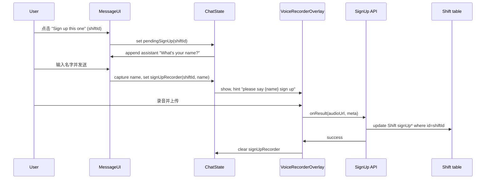

# Search shift 结果内联「Sign up this one」与录音落库方案

## 1. 目标与约束

- **展示**：每个 shift 结果后紧跟一个「Sign up this one」按钮，视觉上像和文字一起输出（不把整段文字和按钮包在一个独立组件里，而是按钮作为“跟着文字”的一环）。
- **流程**：点击 → AI 问名字 → 用户发一条消息（名字）→ 捕获到变量 → 弹出项目内公共录音浮层 → 浮层内显示 "please say {刚刚捕获的名字} sign up" → 用户录音并上传 → 文件进 Vercel Blob，URL + 元数据写入该 shift 的 signUp* 列，且全程对应「当前选中的这条 shift」。

## 2. 技术要点

- **内联按钮**：不改变现有「整段 AI 文本用 `<Response>`（Streamdown）渲染」的主结构，而是对**助理文本**做一次解析：用约定好的占位符把「文字」和「按钮」拆开，再按顺序渲染「文字片段 + 按钮 + 文字片段 + …」，这样按钮就像跟着文字一起输出。
- **占位符约定**：在 prompt 里规定，当 AI 展示 SHOW_RESULTS_NOW 时，每个 shift 块末尾输出一行占位符，例如 `[__SIGN_UP__:id=<shiftId>]`（shiftId 来自 searchShift 返回的 `results[].id`）。前端用正则解析该占位符，拆成段落并在占位符位置渲染「Sign up this one」按钮（带 `shiftId`）。
- **问名字与捕获**：点击按钮后，用「注入一条助理消息」的方式让界面显示“问名字”（例如 "What's your name?"），同时在前端设 `pendingSignUpShiftId`（及后续需要的状态）。用户下一条发送的**文本**视为名字：在发送逻辑里若存在 pending sign-up，则拦截本次发送、把输入内容当作名字存入变量、用于后续浮层文案和落库，并可选地把这条消息仅做本地展示（不发给 AI），避免对话被带偏。
- **录音浮层**：复用现有 `[VoiceRecorderOverlay](components/voice-recorder-overlay.tsx)`，通过 `recordingTitle` 或 `recordingHints` 显示 "please say {name} sign up"。浮层由 Chat 层或能访问 `sendMessage`/`setMessages` 的父组件控制显隐（例如 `showSignUpRecorder` + `signUpContext: { shiftId, userName }`），录音结果在 `onResult` 里拿到 Blob URL 后调用「更新该 shift 的 sign-up 信息」的 API。
- **数据库**：只写 Shift 表已有、以 signUp 开头的列；若本地 schema 尚未声明，需在 `[lib/db/schema.ts](lib/db/schema.ts)` 中补全这些列定义（与远程表一致）；若远程表还没有这些列，再增加一次 migration 创建它们。

## 3. 实现步骤（按依赖顺序）

### 3.1 数据库与 API

- **Schema**  
  - 在 `[lib/db/schema.ts](lib/db/schema.ts)` 的 `shift` 表中声明与远程表一致的 signUp 列（远程已有，仅同步 schema，无需 migration）：  
    - `signUpUserName` (text)、`signUpAudioUrl` (text)、`signUpAudioDurationMs` (integer)、`signUpAudioMimeType` (text)、`signUpAudioSizeBytes` (integer)、`signUpCreatedAt` (timestamp)。
- **写入 API**  
  - 新增接口 `PATCH /api/shifts/[id]/sign-up`。  
  - 请求体：`{ name: string, audioUrl: string, audioDurationMs?: number, audioMimeType?: string, audioSizeBytes?: number }`；服务端映射为：`name` → `signUpUserName`，`audioUrl` → `signUpAudioUrl`，并写入 `signUpAudioDurationMs`、`signUpAudioMimeType`、`signUpAudioSizeBytes`；同时设置 `signUpCreatedAt = new Date()`。  
  - 对该 shift 做 `update` 仅更新上述 signUp* 列；需做存在性与权限校验。
- **上传**  
  - 录音仍走现有 `[/api/files/upload](app/(chat)`/api/files/upload/route.ts) 上传到 Vercel Blob；`VoiceRecorderOverlay` 的 `onResult` 里已经拿到 `audioUrl`，只需再调用上面的 sign-up API，把该 URL 和元数据写入对应 shift。

### 3.2 Prompt：让 AI 在每条结果后输出占位符

- 在 `[lib/ai/prompts.ts](lib/ai/prompts.ts)` 的 Search shift 说明里，在「SHOW_RESULTS_NOW」格式要求中增加一条：  
  - 每展示完一个 shift 的完整信息块后，必须另起一行输出：`[__SIGN_UP__:id=<该条 shift 的 id>]`（id 来自 tool 返回的 `results[].id`）。  
  - 说明该标记用于前端渲染「Sign up this one」按钮，不要省略或改格式。

### 3.3 前端：解析助理文本并内联渲染按钮

- **解析与渲染**  
  - 在渲染助理「text」part 的地方（`[components/message.tsx](components/message.tsx)` 里对 `type === "text"` 且非用户的分支），不要直接把 `part.text` 交给 `<Response>`。  
  - 先用正则（如 `/\[__SIGN_UP__:id=([^\]]+)\]/g`）把文本拆成多段：`[ segment0, shiftId1, segment1, shiftId2, ... ]`。  
  - 再按顺序渲染：奇数索引为 shiftId，偶数索引为文本；文本段用 `<Response>{segment}</Response>`，shiftId 位置渲染一个内联按钮「Sign up this one」，并传入 `shiftId`（和必要的无障碍属性，符合项目 a11y 规则）。
- **样式**  
  - 按钮使用与现有消息气泡一致的排版（例如 `inline` 或 `inline-block`），使其在段落中「跟着文字」出现，而不是单独一大块。

### 3.4 点击「Sign up this one」后的流程

- **状态**  
  - 在 Chat 层（或能同时访问 `setMessages`、输入框、录音浮层的上下文）维护：  
    - `pendingSignUp: { shiftId: string } | null`  
    - 可选：`signUpRecorder: { shiftId: string; userName: string } | null`（用于控制浮层显隐和文案）。
- **点击按钮**  
  - 设置 `pendingSignUp = { shiftId }`。  
  - 通过 `setMessages` 追加一条助理消息，内容为 "What's your name?"（或你希望 AI 问的那句话），这样界面上是「AI 在问名字」。
- **用户发送「名字」**  
  - 在负责发送消息的逻辑里（例如 `[components/multimodal-input.tsx](components/multimodal-input.tsx)` 或 Chat 内处理 submit 的地方）：  
    - 若 `pendingSignUp !== null`：  
      - 将当前输入内容当作 `userName` 存下来。  
      - 用 `setMessages` 把这条消息作为用户消息追加到对话中（仅本地，不调用 `sendMessage` 发到后端，避免 AI 继续接话）。  
      - 设置 `signUpRecorder = { shiftId: pendingSignUp.shiftId, userName }`，并清空 `pendingSignUp`。  
      - 清空输入框。
- **弹出录音浮层**  
  - 当 `signUpRecorder !== null` 时渲染 `VoiceRecorderOverlay`，并传入：  
    - `recordingTitle` 或 `recordingHints`：包含 `"please say {signUpRecorder.userName} sign up"`（或拆成一行 hint）。  
    - `onResult`：用 `onResult` 返回的 `audioUrl`、`durationMs`、`mimeType`、`sizeBytes` 调用 `PATCH /api/shifts/[id]/sign-up`（id = `signUpRecorder.shiftId`），body 含 `name: signUpRecorder.userName` 及上述元数据；成功后关闭浮层（置空 `signUpRecorder`），可 toaster 提示成功。
- **浮层放置**  
  - 若当前 `VoiceRecorderOverlay` 只在 MultimodalInput 内用于 Post shift，则需要在 Chat 页或共享布局里再挂一层 `VoiceRecorderOverlay`，由 `signUpRecorder !== null` 驱动显示，并传入上述 props；或把「Sign-up 录音」和「Post shift 录音」统一成一个可配置的 overlay，通过 props 区分文案与 `onResult` 行为。

### 3.5 全程对应「选中的 shift」

- 从点击的「Sign up this one」按钮得到 `shiftId` → 存入 `pendingSignUp.shiftId` → 用户输入名字后存入 `signUpRecorder.shiftId` → 录音完成时用该 `shiftId` 调用 `PATCH /api/shifts/[id]/sign-up`。  
- 服务端 API 只根据 URL 中的 `id` 更新对应 Shift 行，不涉及其它 shift，保证「选哪条就写哪条」。

## 4. 数据流简图

## 5. 文件与改动小结

| 区域     | 文件                                                                                                                | 改动                                                                                                                                                            |
| ------ | ----------------------------------------------------------------------------------------------------------------- | ------------------------------------------------------------------------------------------------------------------------------------------------------------- |
| Schema | `[lib/db/schema.ts](lib/db/schema.ts)`                                                                            | 为 `shift` 表增加 signUp* 列定义：signUpUserName, signUpAudioUrl, signUpAudioDurationMs, signUpAudioMimeType, signUpAudioSizeBytes, signUpCreatedAt（与远程表一致，仅改 schema） |
| API    | `app/(chat)/api/shifts/[id]/sign-up/route.ts`（新建）                                                                 | PATCH：接收 name（→ signUpUserName）+ audio 元数据，并设置 signUpCreatedAt；更新该 shift 的 signUp* 列                                                                          |
| Prompt | `[lib/ai/prompts.ts](lib/ai/prompts.ts)`                                                                          | SHOW_RESULTS_NOW 时每条 shift 后输出 `[__SIGN_UP__:id=<id>]`                                                                                                        |
| 消息渲染   | `[components/message.tsx](components/message.tsx)`                                                                | 解析 text 中的占位符，分段渲染 Response + 内联 Sign up 按钮                                                                                                                   |
| 状态与发送  | `[components/chat.tsx](components/chat.tsx)`、`[components/multimodal-input.tsx](components/multimodal-input.tsx)` | pendingSignUp / signUpRecorder；发送时若 pendingSignUp 则拦截并走「捕获名字 → 开浮层」                                                                                           |
| 录音浮层   | `[components/voice-recorder-overlay.tsx](components/voice-recorder-overlay.tsx)` 或 Chat 层                         | 在 Chat 侧根据 signUpRecorder 渲染浮层并传入 "please say {name} sign up" 与 onResult 调 sign-up API                                                                        |

## 6. 已确认的 signUp 列（与远程表一致）

- `signUpUserName`、`signUpAudioUrl`、`signUpAudioDurationMs`、`signUpAudioMimeType`、`signUpAudioSizeBytes`、`signUpCreatedAt`。API 请求体中的 `name` 写入 `signUpUserName`；更新时服务端设置 `signUpCreatedAt = new Date()`。

